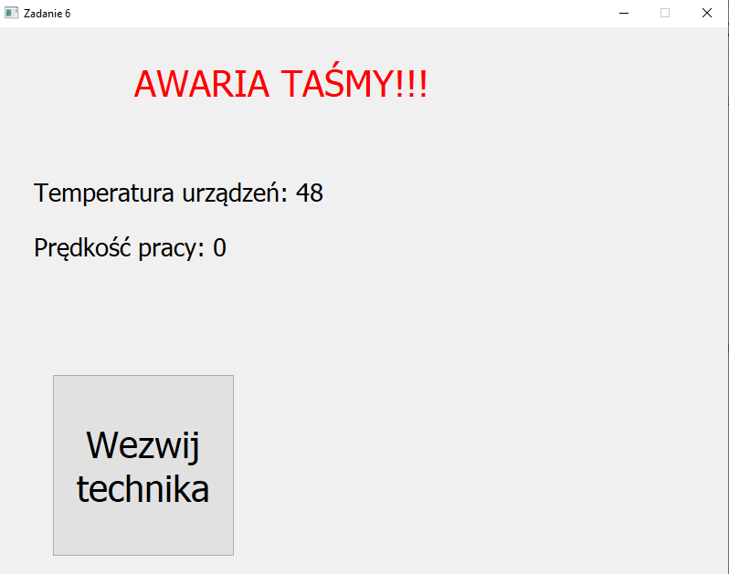
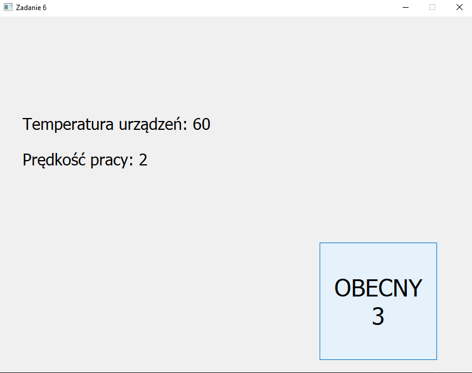


# Dokumentacja projektu 6

Wykonawcy:
**Jakub Osielski 171973**
**Tomasz Szymański 160286**

## Polecenie

Tematem zadania szóstego jest napisanie aplikacji, będącej symulatorem stanowiska dyspozytorskiego „linii produkcyjnej”.Program ten ma zawierać elementy diagnostyki nadzorowanego „procesu produkcji” jak i  autodiagnostyki operatora czuwającegonad prawidłowym przebiegiem „produkcji”. Wykorzystując dostępne informacje na temat parametrów pracy komputera PC (np.temperatury rdzenia procesora, stopnia wykorzystania procesora, prędkości obrotowych wentylatorów itp.) oraz generatory liczblosowych i timery, zasymulować parametry kontrolowanego „procesu produkcyjnego”. Należy przewidzieć obsługę pojawiającychsię losowo awarii oraz przekroczeń granicznych  wartości wybranych parametrów procesu   - np. po przekroczeniu granicznejtemperatury obudowy silnika należy włączyć dodatkowy wentylator lub zwolnić tempo pracy linii produkcyjnej itp. O wszystkichwyjątkowych zdarzeniach i wymaganych działaniach, operator musi być informowany za pośrednictwem odpowiedniego zestawukomunikatów. Program powinien zawierać okno logowania do aplikacji i na bieżąco badać obecność oraz „przytomność” operatora.Element autodiagnostyczny powinien polegać na okresowym pojawianiu się komunikatu informującego o konieczności potwierdzeniaobecności przez wciśnięcie wybranego klawisza. W przypadku  braku potwierdzenia, np. przez co najmniej 30 sekund, powinnonastępować uruchomienie alarmu i wylogowanie operatora z systemu.
## Założenia projektowe

Program został wykonany przy wykorzystaniu języka programowania Python w wersji 3.7. Sposób generowania temperatury jest losowy - jest to tylko symulacja. Na potrzeby prezentacji, aby możliwe było zaobserwowanie działania na przykład awarii, współczynnik na start programu ma ustawioną domyślnie bardzo małą wartość (bardzi duże prawdopodobieństwo zajścia awarii), które jednak bardzo szybko maleje do szansy bliższej rzeczywistości. 

## Realizacja
Program wymaga od użytkownika wstępnego zalogowania się (hasło: admin, login: admin). Po zalogowaniu w odstępach 30 sekund od użytkownika wymagane jest wciśnięcie przcisku obecności. Po odliczeniu, użytkownik zostaje automatycznie wylogowany.

### Temperatura

Temperatura startowa to 50 stopni, a jej wartość zmienia się w sposób losowy w zależności od stanu aktualnego. Fragment pętli działania programu przedstawiono na poniższym zdjęciu.

### Prędkość

Podobnie jak w przypadku temperatury, zmiany prędkości pracy są generowane w sposób losowy - fragment kodu poniżej.

## Podsumowanie, uwagi
Projekt chociaż wydaje się minimalistyczny to spełnia swoje zadanie i pozwala przeprowadzić prostą symulację. 

### Zalety
- Czytelny design

### Wady
- Prostota, a przez to brak złożonych sytuacji
